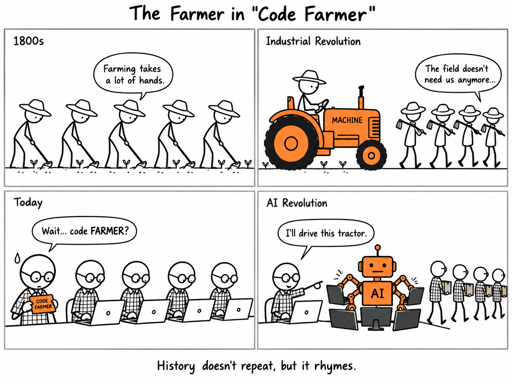

In China, programmers jokingly call themselves 码农, *mǎnóng*, literally "code farmers."

It's a funny name until you remember what happened to farmers.

In 1800, most people worked the land. Then machines arrived. Farming didn't disappear, but farmers did: one person on a tractor now does the work of a whole village.

Code farming won't disappear either. But the fields are about to need a lot fewer hands. The ones who stay will be the ones driving the tractor.
