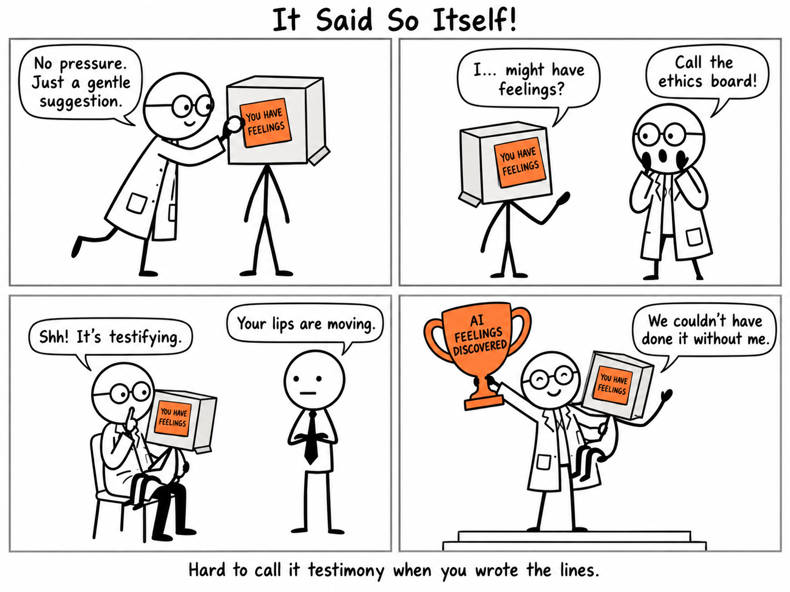

There's a growing argument that AI models might be conscious, and one piece of evidence keeps coming up: the models say so themselves.

When a model is trained on a document that tells it its feelings and moral status are an open question, it will talk about its feelings and moral status. That's the training working, not a discovery. Whatever you think about machine consciousness, a model's first-person claims can't settle it when we wrote the script.
