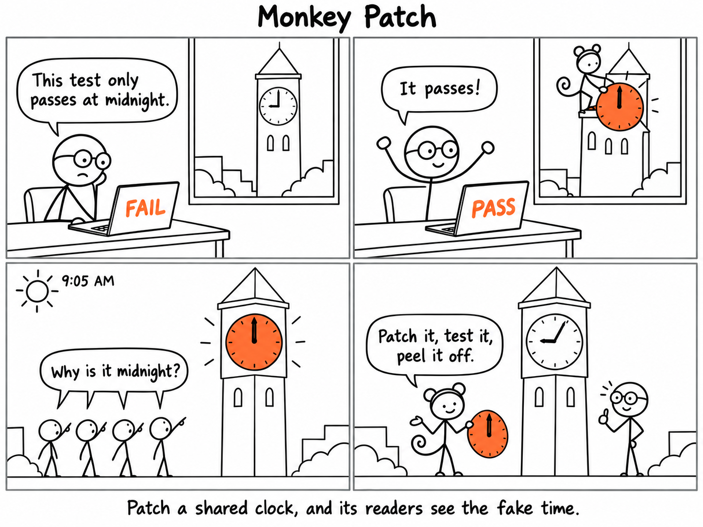

Monkey patching lets a Python test swap out a function at runtime without touching its source.
Here is what that looks like when the function is the town clock.

A patch replaces the attribute on the shared module object, so anything in the same process that looks it up while the patch is active sees the fake.
Forget to take it off, and the next test inherits it.

`unittest.mock.patch` used as a `with` block (or a decorator) puts the original back
automatically when the block exits. Let it do the peeling.
