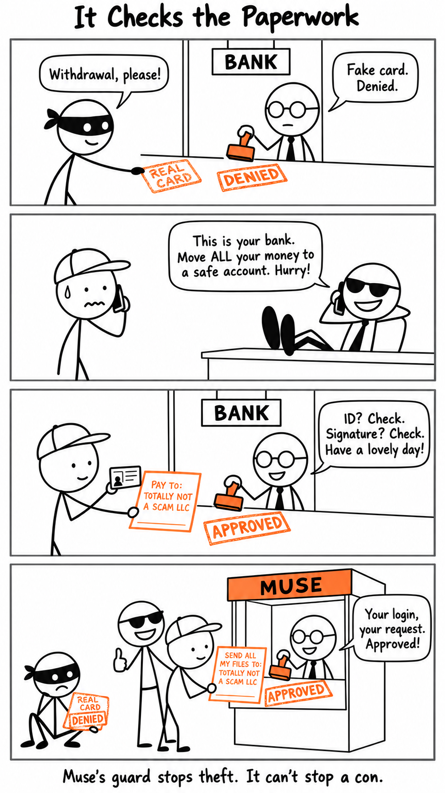

A guard that checks who you are is great at stopping a thief. It has no idea what to do with a victim.

Muse's guard works like a bank teller. A stolen key or a forged identity gets caught. But when someone talks you into making the request yourself, every check passes: your login, your request, your signature. The guard checks the paperwork. It can't see that you were conned.

So the guard isn't the last line of defense. You are.
